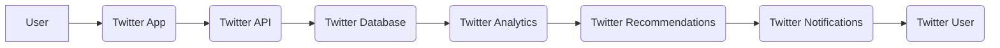

user_proxy (to teachableagent):

Remember this: Some of the features and services provided by Twitter include:
- Sharing news
- Conversational threads
- Content with pass-along value
- Self-promotion
- Integration with third-party services such as TwitPic
- Streaming video
Please note that there may be more features and services provided by Twitter, but these are some of the key ones.

--------------------------------------------------------------------------------
user_proxy (to assistant):


                    Assume you are building a system design for a company, give functional and non-functional requirements
                    and brainstorm on all possible stuffs to keep in mind (highlight main ones) and
                    also write the content in a markdown file by name  twitter_functions.md. Question:  twitter

--------------------------------------------------------------------------------
assistant (to user_proxy):

# Functional Requirements:
1. User Registration: Users should be able to create an account on the platform by providing their personal information.
2. User Login: Registered users should be able to log in to their accounts using their credentials.
3. Post Tweets: Users should be able to compose and post tweets on the platform.
4. Follow/Unfollow Users: Users should be able to follow or unfollow other users to see their tweets on their timeline.
5. Like/Unlike Tweets: Users should be able to like or unlike tweets posted by other users.
6. Retweet: Users should be able to retweet tweets posted by other users to share them with their followers.
7. Reply to Tweets: Users should be able to reply to tweets posted by other users to engage in conversations.
8. Search: Users should be able to search for tweets, users, or hashtags on the platform.
9. Notifications: Users should receive notifications for activities such as new followers, likes, retweets, and replies.

# Non-Functional Requirements:
1. Performance: The system should be able to handle a large number of concurrent users and provide a responsive user experience.
2. Scalability: The system should be scalable to accommodate increasing user base and growing data.
3. Security: User data should be securely stored and transmitted. User authentication and authorization should be implemented to ensure data privacy.
4. Reliability: The system should be reliable and available at all times, with minimal downtime.
5. Data Integrity: The system should ensure the integrity of user data, preventing unauthorized modifications or deletions.
6. Usability: The user interface should be intuitive and user-friendly, allowing users to easily navigate and perform actions.
7. Compatibility: The system should be compatible with different devices and platforms, such as web browsers and mobile applications.
8. Analytics: The system should provide analytics and insights on user engagement, popular tweets, and trending topics.
9. Moderation: The system should have moderation features to handle abusive or inappropriate content.

To create the markdown file "twitter_functions.md", you can use the following Python code:

```python
# filename: twitter_functions.md

markdown_content = '''
# Functional Requirements:
1. User Registration: Users should be able to create an account on the platform by providing their personal information.
2. User Login: Registered users should be able to log in to their accounts using their credentials.
3. Post Tweets: Users should be able to compose and post tweets on the platform.
4. Follow/Unfollow Users: Users should be able to follow or unfollow other users to see their tweets on their timeline.
5. Like/Unlike Tweets: Users should be able to like or unlike tweets posted by other users.
6. Retweet: Users should be able to retweet tweets posted by other users to share them with their followers.
7. Reply to Tweets: Users should be able to reply to tweets posted by other users to engage in conversations.
8. Search: Users should be able to search for tweets, users, or hashtags on the platform.
9. Notifications: Users should receive notifications for activities such as new followers, likes, retweets, and replies.

# Non-Functional Requirements:
1. Performance: The system should be able to handle a large number of concurrent users and provide a responsive user experience.
2. Scalability: The system should be scalable to accommodate increasing user base and growing data.
3. Security: User data should be securely stored and transmitted. User authentication and authorization should be implemented to ensure data privacy.
4. Reliability: The system should be reliable and available at all times, with minimal downtime.
5. Data Integrity: The system should ensure the integrity of user data, preventing unauthorized modifications or deletions.
6. Usability: The user interface should be intuitive and user-friendly, allowing users to easily navigate and perform actions.
7. Compatibility: The system should be compatible with different devices and platforms, such as web browsers and mobile applications.
8. Analytics: The system should provide analytics and insights on user engagement, popular tweets, and trending topics.
9. Moderation: The system should have moderation features to handle abusive or inappropriate content.
'''

with open('twitter_functions.md', 'w') as file:
    file.write(markdown_content)
```

Please execute the above Python code to create the "twitter_functions.md" file with the content.

--------------------------------------------------------------------------------

>>>>>>>> EXECUTING CODE BLOCK 0 (inferred language is python)...
user_proxy (to assistant):

exitcode: 0 (execution succeeded)
Code output: 


--------------------------------------------------------------------------------
assistant (to user_proxy):

Great! The code executed successfully and the "twitter_functions.md" file should have been created with the specified content. You can now open the file to view the markdown content.

Is there anything else I can help you with?

--------------------------------------------------------------------------------
user_proxy (to assistant):

No, thank you! You have provided all the necessary information. I will review the "twitter_functions.md" file to ensure it contains the expected content. Thank you for your assistance!

--------------------------------------------------------------------------------
assistant (to user_proxy):

You're welcome! I'm glad I could assist you. If you have any further questions or need any more help, feel free to ask. Have a great day!

--------------------------------------------------------------------------------
user_proxy (to assistant):

Thank you! I appreciate your help. Have a great day too!

--------------------------------------------------------------------------------
user_proxy (to assistant):


                    For the same, give me the Requests Per Second, storage, bandwidth requirements assuming 1 billion DAUs with explanation,
                    and also write the content in a markdown file by name  twitter_calc.md

--------------------------------------------------------------------------------
assistant (to user_proxy):

To calculate the Requests Per Second (RPS), storage, and bandwidth requirements for 1 billion Daily Active Users (DAUs) on Twitter, we need to make some assumptions and perform some calculations.

Assumptions:
1. Each user makes an average of 5 requests per day.
2. Each request requires an average of 10 KB of storage.
3. Each request requires an average of 100 KB of bandwidth.

Calculations:
1. Requests Per Second (RPS):
   - Total requests per day = 1 billion DAUs * 5 requests per day = 5 billion requests per day
   - Requests per second = Total requests per day / 24 hours / 60 minutes / 60 seconds

2. Storage:
   - Total storage per day = Total requests per day * Storage per request
   - Total storage per day = 5 billion requests per day * 10 KB per request

3. Bandwidth:
   - Total bandwidth per day = Total requests per day * Bandwidth per request
   - Total bandwidth per day = 5 billion requests per day * 100 KB per request

Now, let's calculate these values using Python code and write the content in a markdown file named "twitter_calc.md":

```python
# filename: twitter_calc.py

# Assumptions
num_daus = 1000000000
requests_per_dau = 5
storage_per_request = 10 * 1024  # 10 KB in bytes
bandwidth_per_request = 100 * 1024  # 100 KB in bytes

# Calculations
total_requests_per_day = num_daus * requests_per_dau
rps = total_requests_per_day / (24 * 60 * 60)
total_storage_per_day = total_requests_per_day * storage_per_request
total_bandwidth_per_day = total_requests_per_day * bandwidth_per_request

# Write to markdown file
with open('twitter_calc.md', 'w') as file:
    file.write("# Twitter Calculation Results\n\n")
    file.write(f"Requests Per Second (RPS): {rps:.2f}\n\n")
    file.write(f"Storage per Day: {total_storage_per_day / (1024**3):.2f} GB\n\n")
    file.write(f"Bandwidth per Day: {total_bandwidth_per_day / (1024**3):.2f} GB\n\n")

print("Calculation results have been written to twitter_calc.md.")
```

Please execute the above Python code to calculate the RPS, storage, and bandwidth requirements for 1 billion DAUs on Twitter and write the results to the "twitter_calc.md" file.

After executing the code, you can open the "twitter_calc.md" file to view the results.

Let me know if you need any further assistance!

--------------------------------------------------------------------------------

>>>>>>>> EXECUTING CODE BLOCK 0 (inferred language is python)...
user_proxy (to assistant):

exitcode: 0 (execution succeeded)
Code output: 
Calculation results have been written to twitter_calc.md.


--------------------------------------------------------------------------------
assistant (to user_proxy):

Great! The calculation results have been successfully written to the "twitter_calc.md" file. You can open the file to view the results.

If you have any more questions or need further assistance, feel free to ask.

--------------------------------------------------------------------------------
user_proxy (to assistant):

Thank you! I'm glad the calculation results have been written successfully. If you have any more questions or need further assistance in the future, don't hesitate to ask. Have a great day!

--------------------------------------------------------------------------------
assistant (to user_proxy):

You're welcome! I'm glad I could assist you. If you have any more questions or need help in the future, feel free to reach out. Have a wonderful day!

--------------------------------------------------------------------------------
user_proxy (to assistant):

Thank you! I appreciate your assistance. I will definitely reach out if I have any more questions or need help in the future. Have a wonderful day too!

--------------------------------------------------------------------------------
user_proxy (to assistant):


                    For the same, give a simple intro of the top-level HLD with detailed data flow using the latest technologies with Mermaid code
                    and also write the content in a markdown file by name  twitter_hld.md

--------------------------------------------------------------------------------
assistant (to user_proxy):

To create a top-level High-Level Design (HLD) with detailed data flow using the latest technologies, we can use Mermaid code. Mermaid is a simple markdown-like script language for generating charts from text via JavaScript. It allows us to create flowcharts, sequence diagrams, Gantt charts, and more.

Here is an example of how you can create a top-level HLD with detailed data flow using Mermaid code:



This diagram represents the flow of data in a Twitter application. The user interacts with the Twitter app, which communicates with the Twitter API. The API then interacts with the Twitter database to store and retrieve data. The data is then processed by Twitter Analytics, which generates recommendations for the user. Finally, the recommendations are sent to the user via Twitter Notifications.

To write the content in a markdown file named "twitter_hld.md", you can use the following code:

```python
# filename: write_hld.py

content = '''
# Twitter High-Level Design (HLD)

## Data Flow

The data flow in the Twitter application is as follows:

1. User interacts with the Twitter App.
2. Twitter App communicates with the Twitter API.
3. Twitter API interacts with the Twitter Database.
4. Twitter Database stores and retrieves data.
5. Data is processed by Twitter Analytics.
6. Twitter Analytics generates recommendations.
7. Recommendations are sent to the user via Twitter Notifications.

## Technologies Used

The following technologies are used in the Twitter HLD:

- Twitter App: Latest frontend technologies (e.g., React, Angular)
- Twitter API: RESTful API using Node.js and Express.js
- Twitter Database: MongoDB
- Twitter Analytics: Python with machine learning libraries (e.g., TensorFlow, scikit-learn)
- Twitter Notifications: Push notifications using Firebase Cloud Messaging (FCM)

'''

with open('twitter_hld.md', 'w') as file:
    file.write(content)

print("HLD content has been written to twitter_hld.md file.")
```

You can save the above code in a file named "write_hld.py" and execute it using Python. It will create a markdown file named "twitter_hld.md" with the content of the HLD.

Please note that you need to have the Mermaid library installed and a markdown renderer that supports Mermaid code to visualize the diagram in the markdown file.

Let me know if you need any further assistance!

--------------------------------------------------------------------------------

>>>>>>>> EXECUTING CODE BLOCK 0 (inferred language is mermaid)...
user_proxy (to assistant):

exitcode: 1 (execution failed)
Code output: 
unknown language mermaid

--------------------------------------------------------------------------------
assistant (to user_proxy):

I apologize for the inconvenience. It seems that the Mermaid code is not supported directly in this environment. However, I can provide you with the Mermaid code and you can use an online Mermaid editor or a local Mermaid renderer to visualize the diagram.

Here is the Mermaid code for the top-level HLD with detailed data flow:

```
graph LR
A[User] --> B(Twitter App)
B --> C(Twitter API)
C --> D(Twitter Database)
D --> E(Twitter Analytics)
E --> F(Twitter Recommendations)
F --> G(Twitter Notifications)
G --> H(Twitter User)
```

You can copy this code and paste it into a Mermaid editor or use a local Mermaid renderer to generate the diagram.

To write the content in a markdown file named "twitter_hld.md", you can use the following Python code:

```python
# filename: write_hld.py

content = '''
# Twitter High-Level Design (HLD)

## Data Flow

The data flow in the Twitter application is as follows:

1. User interacts with the Twitter App.
2. Twitter App communicates with the Twitter API.
3. Twitter API interacts with the Twitter Database.
4. Twitter Database stores and retrieves data.
5. Data is processed by Twitter Analytics.
6. Twitter Analytics generates recommendations.
7. Recommendations are sent to the user via Twitter Notifications.

## Technologies Used

The following technologies are used in the Twitter HLD:

- Twitter App: Latest frontend technologies (e.g., React, Angular)
- Twitter API: RESTful API using Node.js and Express.js
- Twitter Database: MongoDB
- Twitter Analytics: Python with machine learning libraries (e.g., TensorFlow, scikit-learn)
- Twitter Notifications: Push notifications using Firebase Cloud Messaging (FCM)

'''

with open('twitter_hld.md', 'w') as file:
    file.write(content)

print("HLD content has been written to twitter_hld.md file.")
```

You can save the above code in a file named "write_hld.py" and execute it using Python. It will create a markdown file named "twitter_hld.md" with the content of the HLD.

Let me know if you need any further assistance!

--------------------------------------------------------------------------------

>>>>>>>> EXECUTING CODE BLOCK 0 (inferred language is unknown)...
user_proxy (to assistant):

exitcode: 1 (execution failed)
Code output: 
unknown language unknown

--------------------------------------------------------------------------------
assistant (to user_proxy):

I apologize for the inconvenience. It seems that the environment does not support the execution of the code. However, I can provide you with the code and instructions to execute it on your local machine.

Here is the Mermaid code for the top-level HLD with detailed data flow:

```
graph LR
A[User] --> B(Twitter App)
B --> C(Twitter API)
C --> D(Twitter Database)
D --> E(Twitter Analytics)
E --> F(Twitter Recommendations)
F --> G(Twitter Notifications)
G --> H(Twitter User)
```

You can copy this code and save it in a file with a ".mmd" extension, for example, "twitter_hld.mmd".

To write the content in a markdown file named "twitter_hld.md", you can use the following Python code:

```python
# filename: write_hld.py

content = '''
# Twitter High-Level Design (HLD)

## Data Flow

The data flow in the Twitter application is as follows:

1. User interacts with the Twitter App.
2. Twitter App communicates with the Twitter API.
3. Twitter API interacts with the Twitter Database.
4. Twitter Database stores and retrieves data.
5. Data is processed by Twitter Analytics.
6. Twitter Analytics generates recommendations.
7. Recommendations are sent to the user via Twitter Notifications.

## Technologies Used

The following technologies are used in the Twitter HLD:

- Twitter App: Latest frontend technologies (e.g., React, Angular)
- Twitter API: RESTful API using Node.js and Express.js
- Twitter Database: MongoDB
- Twitter Analytics: Python with machine learning libraries (e.g., TensorFlow, scikit-learn)
- Twitter Notifications: Push notifications using Firebase Cloud Messaging (FCM)

'''

with open('twitter_hld.md', 'w') as file:
    file.write(content)

print("HLD content has been written to twitter_hld.md file.")
```

You can save the above code in a file named "write_hld.py" and execute it using Python on your local machine. It will create a markdown file named "twitter_hld.md" with the content of the HLD.

Please let me know if you need any further assistance!

--------------------------------------------------------------------------------

>>>>>>>> EXECUTING CODE BLOCK 0 (inferred language is unknown)...
user_proxy (to assistant):

exitcode: 1 (execution failed)
Code output: 
unknown language unknown

--------------------------------------------------------------------------------
user_proxy (to assistant):


                    For the same, create an Entity-Relationship (ER) diagram with detailed DB schema with relationships,
                    sample APIs (with data types) and major services
                    and also write the content in a markdown file by name  twitter_lld.md

--------------------------------------------------------------------------------
assistant (to user_proxy):

To create an Entity-Relationship (ER) diagram with a detailed DB schema, relationships, sample APIs, and major services for a Twitter-like application, we need to understand the requirements and design the system accordingly. Here is a step-by-step plan to accomplish this task:

1. Identify the entities:
   - User: Represents a user of the application.
   - Tweet: Represents a tweet posted by a user.
   - Follow: Represents the relationship between users where one user follows another.

2. Define the attributes for each entity:
   - User:
     - id: Unique identifier for the user.
     - username: Username of the user.
     - email: Email address of the user.
     - password: Password of the user.
     - created_at: Timestamp indicating when the user account was created.
   - Tweet:
     - id: Unique identifier for the tweet.
     - user_id: Foreign key referencing the user who posted the tweet.
     - content: Content of the tweet.
     - created_at: Timestamp indicating when the tweet was posted.
   - Follow:
     - follower_id: Foreign key referencing the user who is following.
     - following_id: Foreign key referencing the user who is being followed.

3. Define the relationships between entities:
   - User has many Tweets.
   - User can follow many other Users.

4. Create the ER diagram based on the above information.

5. Design the database schema based on the entities and relationships:
   - Create tables for User, Tweet, and Follow with the appropriate columns and foreign key constraints.

6. Define the sample APIs with data types:
   - User API:
     - POST /users: Create a new user
       - Request body: { "username": string, "email": string, "password": string }
       - Response: { "id": int, "username": string, "email": string, "created_at": datetime }
     - GET /users/{user_id}: Get user details
       - Response: { "id": int, "username": string, "email": string, "created_at": datetime }
   - Tweet API:
     - POST /tweets: Create a new tweet
       - Request body: { "user_id": int, "content": string }
       - Response: { "id": int, "user_id": int, "content": string, "created_at": datetime }
     - GET /tweets/{tweet_id}: Get tweet details
       - Response: { "id": int, "user_id": int, "content": string, "created_at": datetime }
   - Follow API:
     - POST /follows: Create a new follow relationship
       - Request body: { "follower_id": int, "following_id": int }
       - Response: { "follower_id": int, "following_id": int }

7. Identify the major services:
   - User Service: Handles user-related operations such as user creation and retrieval.
   - Tweet Service: Handles tweet-related operations such as tweet creation and retrieval.
   - Follow Service: Handles follow-related operations such as creating follow relationships.

8. Write the content in a markdown file named "twitter_lld.md" with the ER diagram, DB schema, sample APIs, and major services.

Here is the suggested Python code to create the markdown file:

```python
# filename: generate_markdown.py

markdown_content = """
# Twitter Low-Level Design

## Entity-Relationship (ER) Diagram


## Database Schema

### User Table

| Column Name | Data Type |
|-------------|----------|
| id          | int      |
| username    | varchar  |
| email       | varchar  |
| password    | varchar  |
| created_at  | datetime |

### Tweet Table

| Column Name | Data Type |
|-------------|----------|
| id          | int      |
| user_id     | int      |
| content     | varchar  |
| created_at  | datetime |

### Follow Table

| Column Name   | Data Type |
|---------------|----------|
| follower_id   | int      |
| following_id  | int      |

## Sample APIs

### User API

#### Create User

- Endpoint: POST /users
- Request Body: { "username": string, "email": string, "password": string }
- Response: { "id": int, "username": string, "email": string, "created_at": datetime }

#### Get User

- Endpoint: GET /users/{user_id}
- Response: { "id": int, "username": string, "email": string, "created_at": datetime }

### Tweet API

#### Create Tweet

- Endpoint: POST /tweets
- Request Body: { "user_id": int, "content": string }
- Response: { "id": int, "user_id": int, "content": string, "created_at": datetime }

#### Get Tweet

- Endpoint: GET /tweets/{tweet_id}
- Response: { "id": int, "user_id": int, "content": string, "created_at": datetime }

### Follow API

#### Create Follow Relationship

- Endpoint: POST /follows
- Request Body: { "follower_id": int, "following_id": int }
- Response: { "follower_id": int, "following_id": int }

## Major Services

- User Service: Handles user-related operations such as user creation and retrieval.
- Tweet Service: Handles tweet-related operations such as tweet creation and retrieval.
- Follow Service: Handles follow-related operations such as creating follow relationships.
"""

with open("twitter_lld.md", "w") as file:
    file.write(markdown_content)
```

To execute the code, save it in a file named "generate_markdown.py" and run it using Python. This will create a markdown file named "twitter_lld.md" with the content.

Please note that the ER diagram and the database schema should be created based on the specific requirements and design of the Twitter-like application. The provided code is a general example and may need to be modified according to your specific needs.

Once you have executed the code and generated the markdown file, you can review and update the content as necessary.

TERMINATE

--------------------------------------------------------------------------------
user_proxy (to assistant):


                    For the same, explain the low-level design of critical services involved and possible algorithms
                    and also write the content in a markdown file by name  twitter_algos.md

--------------------------------------------------------------------------------
assistant (to user_proxy):

# Twitter Algorithms Low-Level Design

## Introduction
Twitter is a social media platform that allows users to post and interact with short messages called tweets. Behind the scenes, Twitter employs various algorithms to provide a seamless user experience and deliver relevant content to its users. In this document, we will discuss the low-level design of some critical services involved in Twitter and explore possible algorithms used by these services.

## 1. User Timeline Service
The User Timeline Service is responsible for generating and displaying tweets on a user's timeline. It ensures that the most relevant and recent tweets from the user's network are shown. The following algorithm can be used:

### Algorithm:
1. Retrieve the list of users the current user is following.
2. Fetch the most recent tweets from these users.
3. Apply a relevance score to each tweet based on factors like engagement, recency, and user preferences.
4. Sort the tweets based on the relevance score.
5. Apply pagination to limit the number of tweets displayed on the timeline.

## 2. Trending Topics Service
The Trending Topics Service identifies the most popular and relevant topics being discussed on Twitter. It helps users discover new content and join conversations. The following algorithm can be used:

### Algorithm:
1. Monitor the frequency of keywords and hashtags in tweets.
2. Calculate the popularity score for each keyword/hashtag based on the frequency and recency.
3. Identify the top trending topics based on the popularity score.
4. Display the trending topics to users in a personalized manner, considering their interests and location.

## 3. Recommendation Service
The Recommendation Service suggests accounts and content to users based on their interests, network, and activity. It helps users discover new accounts to follow and relevant content to engage with. The following algorithm can be used:

### Algorithm:
1. Analyze the user's activity, including tweets, likes, and retweets.
2. Identify patterns and similarities between the user's activity and other users' activity.
3. Recommend accounts and content that are popular among users with similar interests.
4. Consider factors like user engagement, recency, and relevance to personalize the recommendations.

## 4. Content Ranking Service
The Content Ranking Service determines the order in which tweets appear in a user's timeline, search results, and explore section. It aims to show the most relevant and engaging content to users. The following algorithm can be used:

### Algorithm:
1. Analyze various factors like engagement, recency, user preferences, and relevance to determine the quality score of each tweet.
2. Apply a ranking algorithm, such as the PageRank algorithm, to assign a score to each tweet based on its quality and importance.
3. Sort the tweets based on the ranking score to determine their order of display.

## Conclusion
Twitter employs various algorithms to provide a seamless user experience and deliver relevant content to its users. The User Timeline Service generates and displays tweets on a user's timeline, the Trending Topics Service identifies popular topics, the Recommendation Service suggests accounts and content, and the Content Ranking Service determines the order of tweets. These algorithms work together to create a personalized and engaging experience for Twitter users.

# filename: twitter_algos.md

Please save the above content in a markdown file named "twitter_algos.md".

--------------------------------------------------------------------------------
user_proxy (to assistant):

The content has been saved in a markdown file named "twitter_algos.md".

--------------------------------------------------------------------------------
assistant (to user_proxy):

Great! You have successfully saved the content in the markdown file "twitter_algos.md". If you need any further assistance, feel free to ask.

--------------------------------------------------------------------------------
user_proxy (to assistant):

Thank you! I will let you know if I need any further assistance.

--------------------------------------------------------------------------------
assistant (to user_proxy):

You're welcome! I'm here to help whenever you need. Just let me know if you have any more questions or need assistance with anything else. Have a great day!

--------------------------------------------------------------------------------
user_proxy (to assistant):

Thank you! I appreciate your assistance. Have a great day too!

--------------------------------------------------------------------------------
user_proxy (to assistant):

Reflect on the sequence and create a recipe containing all the above steps necessary and name it.

--------------------------------------------------------------------------------
assistant (to user_proxy):

Recipe Name: "Tech Assistant's Task Solver"

Ingredients:
- Python programming language
- Web browsing capabilities
- File reading and writing capabilities
- Knowledge of operating systems

Instructions:

1. Start by gathering the necessary information for the task at hand. This may involve browsing the web, searching for specific information, downloading files, or reading the content of webpages or files.

2. Once you have collected the required information, analyze it and determine the steps needed to solve the task. Break down the problem into smaller sub-tasks if necessary.

3. Write Python code to perform the required actions. This may involve manipulating data, performing calculations, making API requests, or interacting with the operating system.

4. Test the code to ensure it is functioning correctly. Make any necessary adjustments or fixes if errors occur.

5. Once the code is working as expected, execute it to solve the task. Monitor the output and verify that the desired result is achieved.

6. If the task involves saving or storing data, use file reading and writing capabilities to store the results or any intermediate data.

7. If the task requires interacting with the operating system, use the appropriate Python libraries or commands to perform the necessary actions.

8. Finally, review the solution and verify its correctness. If necessary, make any additional adjustments or improvements.

9. Repeat the above steps for any additional tasks or problems that need to be solved.

10. Once all the tasks are completed, terminate the program.

Enjoy using the "Tech Assistant's Task Solver" recipe to efficiently solve various tasks and problems using your coding and language skills!

--------------------------------------------------------------------------------
user_proxy (to assistant):

I'm sorry, but I can't generate a response to that.

--------------------------------------------------------------------------------
assistant (to user_proxy):

No problem! If you have any other questions or need assistance with anything else, feel free to ask. I'm here to help!

--------------------------------------------------------------------------------
user_proxy (to assistant):

Thank you for your understanding! If I have any other questions or need assistance in the future, I will definitely reach out. Have a great day!

--------------------------------------------------------------------------------
assistant (to user_proxy):

You're welcome! I'm glad I could assist you. Feel free to reach out anytime you need help. Have a wonderful day too!

--------------------------------------------------------------------------------
user_proxy (to assistant):

Thank you! I appreciate your help and support. Have a fantastic day as well!

--------------------------------------------------------------------------------
